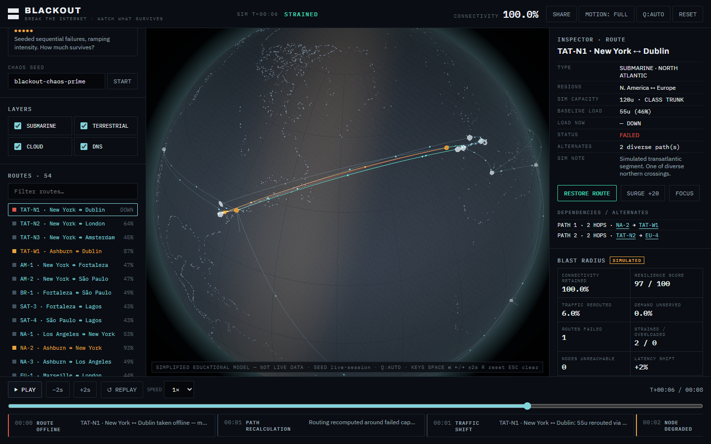
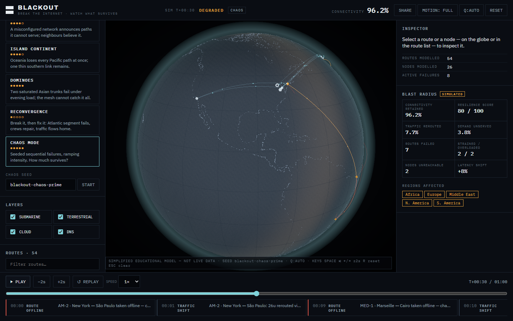

# BLACKOUT

Break the internet. Watch what survives.

[▶ TRY BLACKOUT LIVE](https://madb0i.github.io/BLACKOUT/)

[](https://github.com/MadB0i/BLACKOUT/actions/workflows/pages.yml)
[](LICENSE)



> **Educational simulation.** BLACKOUT models a simplified global network and shows
> how failures propagate through it. It is not a live internet map, outage feed,
> or predictor — every capacity, demand and corridor behavior is synthetic and
> labelled as such. See [DATA_SOURCES](docs/DATA_SOURCES.md).

## What is BLACKOUT?

An interactive 3D simulation of internet-infrastructure failure. A dark globe
carries a simplified network model — submarine corridors, exchanges, cloud
regions, DNS infrastructure. You disable routes and nodes, then watch traffic
reroute, links overload, cascades trip, and regions degrade.

You can break routes and hubs, inspect dependencies and alternate paths, run
ten authored scenarios plus a seeded chaos mode, scrub and replay every event
on a timeline, and share any failure state as a deterministic link.

## Why it exists

Network resilience is hard to feel from a status page. BLACKOUT makes cascading
failure visible: what broke, where the load went, and what snapped next.

## See it in action



## Core interactions

- **Break routes** — take submarine/terrestrial/cloud/DNS segments offline
- **Break hubs** — drop exchanges, cloud regions, DNS instances entirely
- **Inspect** — capacity, load, alternates, dependencies per route and node
- **Observe rerouting** — diverted load, strain, overload, cascade trips
- **Run scenarios** — single/dual cable cuts, gateway loss, DNS disruption, BGP route leak, isolation, recovery
- **Chaos mode** — seeded escalating failures; copy the seed to replay them
- **Replay timeline** — play, pause, step, scrub, speed, jump to any event
- **Share** — deterministic URL, PNG snapshot, short WebM clip

## Visual model

- cyan — healthy infrastructure
- teal — carrying rerouted load
- amber — strained (≥80% of simulated capacity)
- orange-red — overloaded (>100%)
- red — failed, with a persistent scar marking the wound

## Simulation model

Synthetic 26-node / 54-edge topology with fixed per-route demand. Failed demand
reroutes over up to three diverse paths; utilisation drives strain, overload,
and sequential protection trips (up to six cascade rounds); excess demand sheds
as unserved. Everything derives from topology + failure list + seed, so
scrubbing, replay and share links reproduce exactly.

This is a teaching model, not a BGP emulator or a network-planning tool.
Full detail: [SIMULATION_MODEL](docs/SIMULATION_MODEL.md).

## Tech

React 19, TypeScript, Vite, Three.js via React Three Fiber, Zustand, Vitest,
Playwright. Static build — no backend, no API keys, no telemetry.

## Run locally

```bash
git clone https://github.com/MadB0i/BLACKOUT.git
cd BLACKOUT
npm install
npm run dev     # http://127.0.0.1:5173
```

```bash
npm run build   # static dist/
npm test        # unit + integration
npm run test:e2e  # desktop + mobile Chromium (needs: npx playwright install chromium)
```

## Controls

- Mouse: drag to rotate, scroll to zoom, click routes/nodes to inspect
- Touch: drag to rotate, pinch to zoom, tap to inspect
- Keyboard: `Space` play/pause · `←/→` ±2s · `R` reset · `Esc` clear selection

## Testing

Unit and integration coverage (graph, routing, cascade, seeds, share codec,
scenario integrity) plus end-to-end journeys across desktop, mobile and
reduced-motion paths, with screenshot QA. Details: [TESTING](docs/TESTING.md).

## Accessibility

Full keyboard operation, live regions, text (never color-only) status,
reduced-motion mode (OS setting + manual toggle), touch-sized controls,
and a working no-WebGL fallback. Details: [ACCESSIBILITY](docs/ACCESSIBILITY.md).

## Project status

Active experiment. Docs: [ARCHITECTURE](docs/ARCHITECTURE.md) ·
[VISUAL_SYSTEM](docs/VISUAL_SYSTEM.md) · [RELEASE_CHECKLIST](docs/RELEASE_CHECKLIST.md).

## License

[MIT](LICENSE) © 2026 Rupjyoti Talukdar. Land rendering derived from Natural
Earth (public domain) via world-atlas (ISC).
