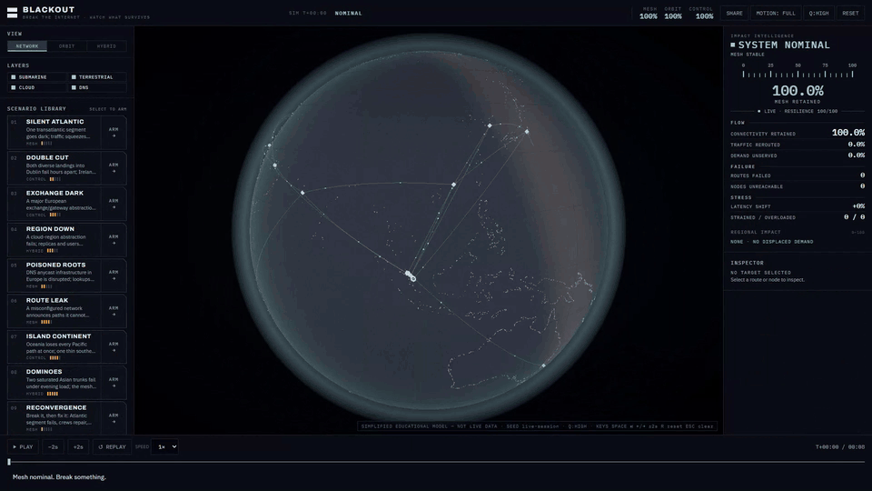
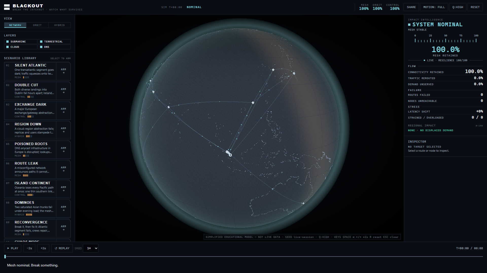
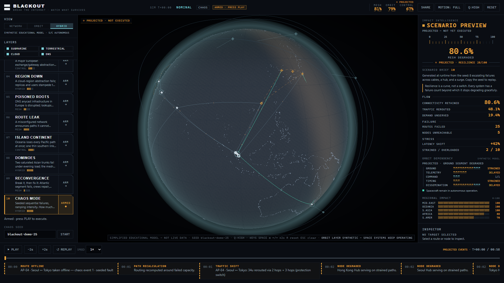
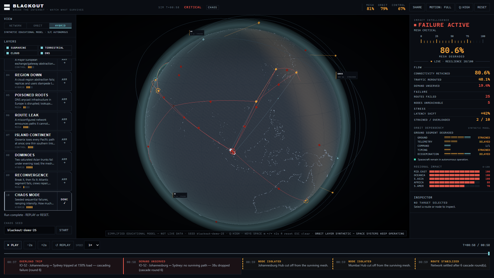

# BLACKOUT

**Break the Internet. Watch What Survives.**

A deterministic visual simulator for exploring how network failures, rerouting,
cascading infrastructure dependencies, and ground-to-orbit connectivity effects
propagate across a simplified planetary system.

[Live Demo](https://madb0i.github.io/BLACKOUT/) · [How It Works](#how-it-works) ·
[Data & Model](docs/DATA_SOURCES.md) · [License](LICENSE)

[](https://github.com/MadB0i/BLACKOUT/actions/workflows/pages.yml)



*Seeded CHAOS MODE (`blackout-demo-25`), from nominal to projected to confirmed
failure. Accelerated playback, ending on a held final frame.*
[MP4 version](docs/media/blackout-demo.mp4)

## What BLACKOUT is

Network resilience is hard to feel from a status page. BLACKOUT makes the
dependencies visible: what broke, where the load went, and what failed next.
The globe connects submarine corridors, terrestrial hubs, cloud regions, DNS
infrastructure, and a synthetic orbital layer in one inspectable model.

This is an educational simulation. It uses no live traffic, outage feed, or
operational satellite data.

## Capabilities

- Fail routes or hubs; inspect load, capacity, alternate paths, and dependencies.
- Explore rerouting, overload trips, unserved demand, resilience, and regional impact.
- Arm a scenario before execution: amber, ghosted/dashed **PROJECTED** treatment
  becomes solid **LIVE** reporting when playback starts.
- Switch between **NETWORK**, **ORBIT**, and **HYBRID**; read **MESH / ORBIT /
  CONTROL** independently in the top strip.
- Trace ground-station backhaul into telemetry, command, timing, and dissemination
  effects while spacecraft retain autonomous operation.
- Pause, step, scrub, replay, or reset a deterministic run; share its state by URL.
- Use the responsive interface with keyboard controls or reduced motion.

## Screenshots

**NETWORK — terrestrial routes under nominal conditions.**
The globe is surrounded by scenario controls, Impact Intelligence, and the timeline.

[](docs/media/blackout-network.png)

<table>
  <tr>
    <td width="50%">
      <a href="docs/media/blackout-hybrid-preview.png"></a>
      <strong>HYBRID · PROJECTED</strong><br>
      An armed scenario shows its expected cost before anything executes.
    </td>
    <td width="50%">
      <a href="docs/media/blackout-hybrid-failure.png"></a>
      <strong>HYBRID · FAILURE ACTIVE</strong><br>
      Confirmed route failures propagate into ground-dependent services.
    </td>
  </tr>
</table>

*Open any screenshot for the full 1920 × 1080 frame.*

## How it works

The synthetic topology contains **26 nodes and 54 routes**, with fixed baseline
demand, capacity, and latency. When a route fails, its demand seeks up to three
diverse surviving paths. Those paths accept load within a headroom limit;
remaining demand becomes unserved. Overloaded links can trip in sequence,
creating a bounded cascade.

Topology, failure steps, simulation time, and seed determine the result.
Replay and scrubbing reconstruct that state rather than approximating it.
The orbital dependency model reads the terrestrial snapshot and reports
ground-station reachability and its downstream effects.

| View | What it shows |
| --- | --- |
| **NETWORK** | Terrestrial routes, infrastructure nodes, traffic, and failures. |
| **ORBIT** | Synthetic orbital classes and ground links, with the terrestrial mesh dimmed. |
| **HYBRID** | Both layers together, so terrestrial and orbital dependencies can be followed in one frame. |

View selection changes the visualization; all three domain readings remain available.

### Scenarios

The library has **ten entries, including seeded CHAOS MODE**. They cover cable
cuts, exchange and cloud-region loss, DNS disruption, a simplified route leak,
regional isolation, cascading overload, and recovery.

Hover previews affected infrastructure. Click to **ARM**, inspect the projected
end state, then press **PLAY**. The selected entry progresses through **ARMED →
LIVE / PAUSED → DONE**. **REPLAY** reruns it; **RESET** returns the system to
nominal. Chaos also accepts a custom seed.

The Impact Intelligence console separates **FLOW**, **FAILURE**, and **STRESS**,
then shows the orbital dependency chain and regional demand affected.
The core reading keeps **LIVE** and **PROJECTED** visibly distinct.

## Model and data limits

BLACKOUT is a simplified teaching model, not a BGP emulator, digital twin, outage
predictor, or network-planning tool. Network capacities, demand, corridor
behavior, and resilience scores are synthetic. Geographic placement is approximate.

The orbital classes, tracks, and ground stations are fictional. Terrestrial
connectivity loss can delay telemetry, reduce mission-control reachability,
interrupt command paths, or degrade timing/distribution and data dissemination.
It does **not** switch spacecraft off: autonomous operation is represented
separately and remains available.

Land rendering derives from Natural Earth through world-atlas.
See [Data Sources](docs/DATA_SOURCES.md) for provenance and licensing, and
[Simulation Model](docs/SIMULATION_MODEL.md) for equations, assumptions, and thresholds.

## Run locally

Use **Node.js 20.19+ or 22.12+** and npm (Vite's supported minimums).

```bash
git clone https://github.com/MadB0i/BLACKOUT.git
cd BLACKOUT
npm ci
npm run dev
```

Open the local URL printed by Vite, normally `http://localhost:5173`.

```bash
npm run build    # type-check and create dist/
npm run preview  # serve the production build locally
```

## Controls

| Input | Action |
| --- | --- |
| Mouse | Drag to rotate, scroll to zoom, click routes or nodes to inspect. |
| Touch | Drag to rotate, pinch to zoom, tap to inspect. |
| `Space` | Play / pause. |
| `←` / `→` | Pause and step back / forward two simulation seconds. |
| `R` / `Esc` | Reset / clear selection. |
| Timeline | Scrub time, select playback speed, or jump to an event. |

The route list provides an alternative to globe picking.

## Testing and verification

The verified baseline is **43 unit/integration tests and 48 E2E checks** across
desktop and mobile Chromium. Coverage includes routing, cascades, scenario
integrity, share-state encoding, orbital dependencies, spacecraft autonomy,
projected/live presentation, lifecycle copy, reduced motion, and replay/reset
determinism. TypeScript, ESLint, and the production build pass.

```bash
npm run lint
npm run build
npm test
npx playwright install chromium
npm run test:e2e
```

See [Testing](docs/TESTING.md) for the browser setup and visual checks.

## Architecture

React, TypeScript, and Vite provide the static application; Three.js / React
Three Fiber render the globe; Zustand holds state. Pure functions in `src/core/`
compute network and orbital dependency snapshots. `src/scene/` renders them,
and `src/ui/` exposes controls and readings. Rendering never decides simulation
outcomes. There is no backend, API key, or telemetry.

[Architecture](docs/ARCHITECTURE.md) · [Visual System](docs/VISUAL_SYSTEM.md)

## Accessibility and reduced motion

Keyboard controls, visible focus, text status, an accessible route list, and live
regions accompany the canvas. Reduced motion honors the OS preference and has
an in-app toggle; it suppresses camera, traffic, and orbital animation while
the simulation remains usable. A no-WebGL fallback preserves controls and data.

The globe itself is not screen-reader navigable; the text interface provides
the alternative. See [Accessibility](docs/ACCESSIBILITY.md) for scope and limits.

## Project status

The current product is functionally complete and verified within its educational
scope. The model is deliberately small and inspectable; scientific limitations
are documented rather than hidden. [Release Checklist](docs/RELEASE_CHECKLIST.md)
tracks publishing preparation and remaining hardware profiling.

## License

[MIT](LICENSE) © 2026 Rupjyoti Talukdar. Natural Earth land data is public domain;
world-atlas is ISC-licensed. See [Data Sources](docs/DATA_SOURCES.md).
